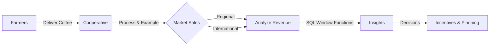

## Student Information

| Attribute      | Details                                      |
| :------------- | :------------------------------------------- |
| **Name**       | GASANA SHEMA Philbert                        |
| **Student ID** | 28279                                        |
| **Group**      | B                                            |
| **Course**     | Database Development with PL/SQL (INSY 8311) |
---

# Agricultural Cooperative Sales Analysis

> **Case Study**: Rwandaro Coffee Farmers Cooperative


## 1. Business Problem Definition

### 1.1 Business Context

Rwandaro Coffee Farmers Cooperative is an agricultural cooperative operating in Rwanda that aggregates coffee produce from registered farmers and sells it to regional and international markets. The cooperative operates within the agribusiness sector and focuses on improving farmer income through collective production, marketing, and value addition.

### 1.2 Data Challenge

Although the cooperative records farmer deliveries and coffee sales, management lacks analytical insight into farmer performance, seasonal sales trends, and inactive members. Manual reporting limits the ability to evaluate growth patterns, compare farmer contributions, and make informed operational decisions.

### 1.3 Expected Outcome

This analysis aims to identify top-contributing farmers, monitor sales performance over time, segment farmers based on contribution levels, and support data-driven decisions related to incentives, training, and operational planning.

---

## 2. Success Criteria

The project aims to achieve the following measurable objectives:

1. Identify the top-performing farmers per season using ranking window functions such as RANK().
2. Calculate running monthly sales totals to track cooperative revenue growth using SUM() OVER().
3. Analyze month-over-month sales changes using navigation functions like LAG().
4. Segment farmers into four contribution quartiles using NTILE(4).
5. Compute three-month moving averages of sales revenue to analyze seasonal trends using AVG() OVER().

---

## Key Features

<table>
<tr>
<td width="50%">

### Analytical Goals

- **Top Farmer Identification**: Ranking contributors by volume/revenue.
- **Sales Trends**: Running totals and monthly growth analysis.
- **Segmentation**: Grouping farmers into performance quartiles.
- **Seasonal Analysis**: 3-Month moving averages to smooth out volatility.

</td>
<td width="50%">

### Technical Implementation

- **Schema Design**: Normalized Relational Model.
- **Complexity**: Nested Queries, CTEs, and Window Functions (`RANK`, `LAG`, `NTILE`, `SUM OVER`).
- **Visualization**: ER Diagram and structured datasets.

</td>
</tr>
</table>

---

## 📊 Workflow Diagram



---

## Database Architecture

The system tracks **Farmers**, **Deliveries**, **Products**, and **Sales**.

<div align="center">
  
  <br>
  <em>Figure 1: Entity Relationship Diagram (ERD)</em>
</div>

> [!TIP]
> View the detailed structure documentation [here](sql/DATABASE_STRUCTURE.md).

---

## 📂 Repository Structure

```tree
plsql_window_functions_28279_philbert
├── 📂 sql/
│   ├── 01_schema.sql
│   ├── 02_sample_data.sql
│   ├── 03_joins.sql
│   ├── 04_window_functions.sql
│   └── *.md
├── 📂 screenshots/
├── 📂 er_diagram/
└── 📄 README.md
```

---

## Results & Analysis

- **Performance Variation**: Significant disparity found between top-performing farmers and average contributors. ([JOINS.md](sql/JOINS.md))
- **Seasonal Trends**: Sales peak during harvest seasons; identified using `AVG() OVER()` moving averages. ([WINDOW_FUNCTIONS.md](sql/WINDOW_FUNCTIONS.md))
- **Actionable Insight**: The segmentation (`NTILE`) suggests the need for a tiered incentive program. ([WINDOW_FUNCTIONS.md](sql/WINDOW_FUNCTIONS.md))

---

## Integrity Statement

> "All sources were properly cited. Implementations and analysis represent original work. No AI-generated content was copied without attribution or adaptation."

---

## References

1.  [Geeks for Geeks](https://www.geeksforgeeks.org/sql/window-functions-in-sql/) — Window Functions
2.  [MySQL Documentation](https://dev.mysql.com/doc/refman/8.0/en/window-functions-usage.html) — MySQL Window Functions
3.  [Rwandaro Coffee Farmers Cooperative Official Website](https://rwandarocoffee.com/)
4.  INSY 8311 Course Materials
5.  [ChatGPT](https://chat.openai.com/) (to refine my english)

---

<div align="center">
  <sub>End of Report | © 2026 Gasana Shema Philbert - 28279</sub>
</div>
