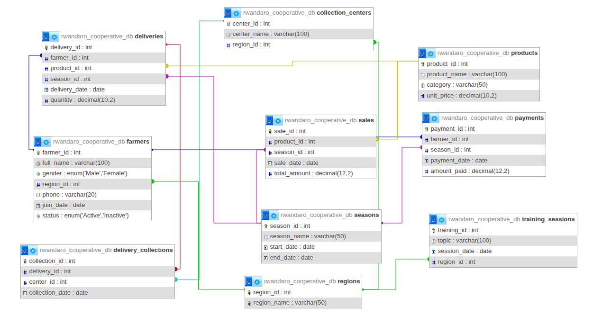

# Project: PL/SQL JOINs & Window Functions Project
## Course: Database Development with PL/SQL (INSY 8311)
## Student Name: GASANA SHEMA Philbert
## Student ID: 28279
## Group: B
## DBMS Used: MySQL 8.0 (XAMPP)

## Project Title
Agricultural Cooperative Sales and Farmer Contribution Performance Analysis  
(**Case Study**: Rwandaro Coffee Farmers Cooperative)

---

## 1. Business Problem Definition

### 1.1 Business Context
Rwandaro Coffee Farmers Cooperative is an agricultural cooperative operating in Rwanda that aggregates coffee produce from registered farmers and sells it to regional and international markets. The cooperative operates within the agribusiness sector and focuses on improving farmer income through collective production, marketing, and value addition.

### 1.2 Data Challenge
Although the cooperative records farmer deliveries and coffee sales, management lacks analytical insight into farmer performance, seasonal sales trends, and inactive members. Manual reporting limits the ability to evaluate growth patterns, compare farmer contributions, and make informed operational decisions.

### 1.3 Expected Outcome
This analysis aims to identify top-contributing farmers, monitor sales performance over time, segment farmers based on contribution levels, and support data-driven decisions related to incentives, training, and operational planning.

---

## 2. Success Criteria
The project aims to achieve the following measurable objectives:

1. Identify the top-performing farmers per season using ranking window functions such as RANK().
2. Calculate running monthly sales totals to track cooperative revenue growth using SUM() OVER().
3. Analyze month-over-month sales changes using navigation functions like LAG().
4. Segment farmers into four contribution quartiles using NTILE(4).
5. Compute three-month moving averages of sales revenue to analyze seasonal trends using AVG() OVER().

---

## 3. Database Schema Design ([Click here](sql/DATABASE_STRUCTURE.md))


### 📊 Entity Relationship Diagram (ERD)


---

## 4. Part - A: SQL JOINs Implementation ([Click here](sql/JOINS.md))


## 5. Part - B: SQL Window Functions Implementation ([Click here](sql/WINDOW_FUNCTIONS.md))


## 6. Results Analysis

### 6.1 Descriptive Analysis
The analysis reveals variations in farmer contributions and product sales across regions and time periods. Certain farmers and products consistently generate higher revenue for the cooperative.

### 6.2 Diagnostic Analysis
Performance differences are influenced by factors such as delivery consistency, regional productivity, and seasonal demand patterns. Inactive farmers contribute to reduced overall output.

### 6.3 Prescriptive Analysis
The cooperative should introduce performance-based incentives for top farmers, provide training and support to underperforming members, and optimize product distribution strategies based on seasonal sales trends.

---

## 7. Repository Structure

``` bash
plsql_window_functions_28279_philbert
│
├── sql/
│   ├── 01_schema.sql
│   ├── 02_sample_data.sql
│   ├── 03_joins.sql
│   ├── 04_window_functions.sql
│   ├── DATABASE_STRUCTURE.md
│   ├── JOINS.md
│   └── WINDOW_FUNCTIONS.md
│
├── screenshots/
├── er_diagram/
└── README.md
```
---

## 8. References

1. MySQL Official Documentation — Window Functions  
2. MySQL Official Documentation — JOIN Operations  
3. Rwandaro Coffee Farmers Cooperative Official Website  
4. INSY 8311 course materials and lecture notes

---

## 9. Integrity Statement

“All sources were properly cited. Implementations and analysis represent original work.
No AI-generated content was copied without attribution or adaptation.”

---

## ✅ Final Notes
- All SQL scripts execute without errors in MySQL 8.0
- Screenshots reflect personal execution results
- Repository is public and professionally organized
