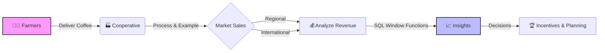

# 🌾 Agricultural Cooperative Sales Analysis

> **Case Study**: Rwandaro Coffee Farmers Cooperative


## 📋 Project Overview

**Rwandaro Coffee Farmers Cooperative** aggregates coffee produce from registered farmers for regional and international markets. Despite having raw data, the cooperative lacks the analytical capability to track farmer performance or seasonal trends efficiently.

This project implements a robust **Database Solution** using **MySQL 8.0** to solve these challenges through:

- **Advanced Join Operations** for data aggregation.
- **Window Functions** for analytical reporting (Ranking, Moving Averages, Quartiles).

---

## 👨‍💻 Student Information

| Attribute      | Details                                      |
| :------------- | :------------------------------------------- |
| **Name**       | GASANA SHEMA Philbert                        |
| **Student ID** | 28279                                        |
| **Group**      | B                                            |
| **Course**     | Database Development with PL/SQL (INSY 8311) |

---

## 🚀 Key Features

<table>
<tr>
<td width="50%">

### 🔍 Analytical Goals

- **Top Farmer Identification**: Ranking contributors by volume/revenue.
- **Sales Trends**: Running totals and monthly growth analysis.
- **Segmentation**: Grouping farmers into performance quartiles.
- **Seasonal Analysis**: 3-Month moving averages to smooth out volatility.

</td>
<td width="50%">

### 🛠 Technical Implementation

- **Schema Design**: Normalized Relational Model.
- **Complexity**: Nested Queries, CTEs, and Window Functions (`RANK`, `LAG`, `NTILE`, `SUM OVER`).
- **Visualization**: ER Diagram and structured datasets.

</td>
</tr>
</table>

---

## 📊 Workflow Diagram



---

## 🗄️ Database Architecture

The system tracks **Farmers**, **Deliveries**, **Products**, and **Sales**.

<div align="center">
  
  <br>
  <em>Figure 1: Entity Relationship Diagram (ERD)</em>
</div>

> [!TIP]
> View the detailed structure documentation [here](sql/DATABASE_STRUCTURE.md).

---

## 📂 Repository Structure

```tree
plsql_window_functions_28279_philbert
├── 📂 sql/                  # Source Code
│   ├── 01_schema.sql           # Table definitions
│   ├── 02_sample_data.sql      # Seeding data
│   ├── 03_joins.sql            # Part A solutions
│   ├── 04_window_functions.sql # Part B solutions
│   └── *.md                    # Documentation files
├── 📂 screenshots/          # Execution proofs
├── 📂 er_diagram/           # Design assets
└── 📄 README.md             # Project documentation
```

---

## 💻 Getting Started

### Prerequisites

- **MySQL Server 8.0+**
- **XAMPP** (Optional, for local stack)
- Use a GUI tool like **MySQL Workbench** or **DBeaver** for best visualization.

### Installation Steps

1.  **Clone the repository** (if using git).
2.  **Initialize Database**:
    Run scripts in this order:
    1.  `sql/01_schema.sql` (Creates Tables)
    2.  `sql/02_sample_data.sql` (Inserts Data)
3.  **Run Analysis**:
    - Execute `sql/03_joins.sql` for JOIN queries.
    - Execute `sql/04_window_functions.sql` for analytical reports.

---

## 📑 Results & Analysis

### 🔎 Highlights

- **Performance Variation**: Significant disparity found between top-performing farmers and average contributors.
- **Seasonal Trends**: Sales peak during harvest seasons; identified using `AVG() OVER()` moving averages.
- **Actionable Insight**: The segmentation (`NTILE`) suggests the need for a tiered incentive program.

> For detailed SQL outputs, see [JOINS.md](sql/JOINS.md) and [WINDOW_FUNCTIONS.md](sql/WINDOW_FUNCTIONS.md).

---

## 📜 Integrity Statement

> "All sources were properly cited. Implementations and analysis represent original work. No AI-generated content was copied without attribution or adaptation."

---

## 🔗 References

1.  MySQL Official Documentation — Window Functions
2.  Rwandaro Coffee Farmers Cooperative Official Website
3.  INSY 8311 Course Materials (Lectures on Analytics)

---

<div align="center">
  <sub>End of Report | © 2026 Gasana Shema Philbert</sub>
</div>
