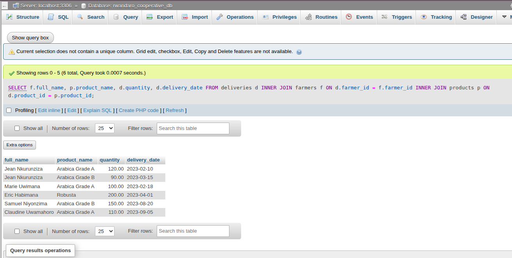
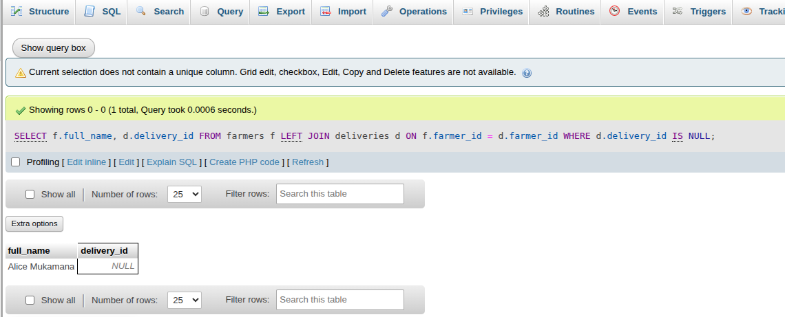
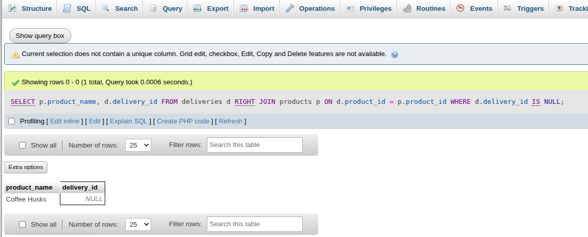
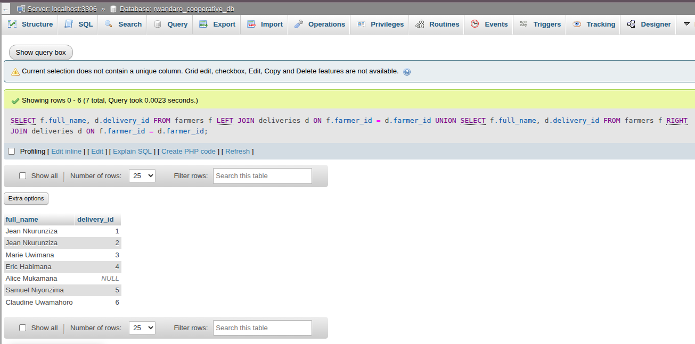

# JOINS
## 1. Ranking farmers by total deliveries
Identifies registered farmers who have never made any deliveries. These farmers may be inactive and may require follow-up or operational support.
```sql
SELECT f.full_name, p.product_name, d.quantity, d.delivery_date
FROM deliveries d
INNER JOIN farmers f ON d.farmer_id = f.farmer_id
INNER JOIN products p ON d.product_id = p.product_id;
```


## 2. LEFT JOIN: Farmers with no deliveries
Identifies registered farmers who have never made any deliveries. These farmers may be inactive and may require follow-up or operational support.
```sql
SELECT f.full_name, d.delivery_id
FROM farmers f
LEFT JOIN deliveries d ON f.farmer_id = d.farmer_id
WHERE d.delivery_id IS NULL;
```


## 3. RIGHT JOIN: Products with no deliveries
Detects products that have not generated any sales activity. This analysis helps identify low-demand products or inefficiencies in market distribution.
```sql
SELECT p.product_name, d.delivery_id
FROM deliveries d
RIGHT JOIN products p ON d.product_id = p.product_id
WHERE d.delivery_id IS NULL;
```


## 4. FULL OUTER JOIN : Farmers and deliveries including unmatched
Compares farmers and deliveries, including unmatched records. This analysis highlights data gaps such as farmers without deliveries and orphan delivery records.
```sql
SELECT f.full_name, d.delivery_id
FROM farmers f
LEFT JOIN deliveries d ON f.farmer_id = d.farmer_id

UNION

SELECT f.full_name, d.delivery_id
FROM farmers f
RIGHT JOIN deliveries d ON f.farmer_id = d.farmer_id;
```

## 5. SELF JOIN: Farmers in same region
Compares farmers operating within the same region. This enables peer performance evaluation and supports regional productivity analysis.
```sql
SELECT a.full_name AS farmer_one,
       b.full_name AS farmer_two,
       r.region_name
FROM farmers a
INNER JOIN farmers b ON a.region_id = b.region_id
   AND a.farmer_id < b.farmer_id
INNER JOIN regions r ON a.region_id = r.region_id;
```

