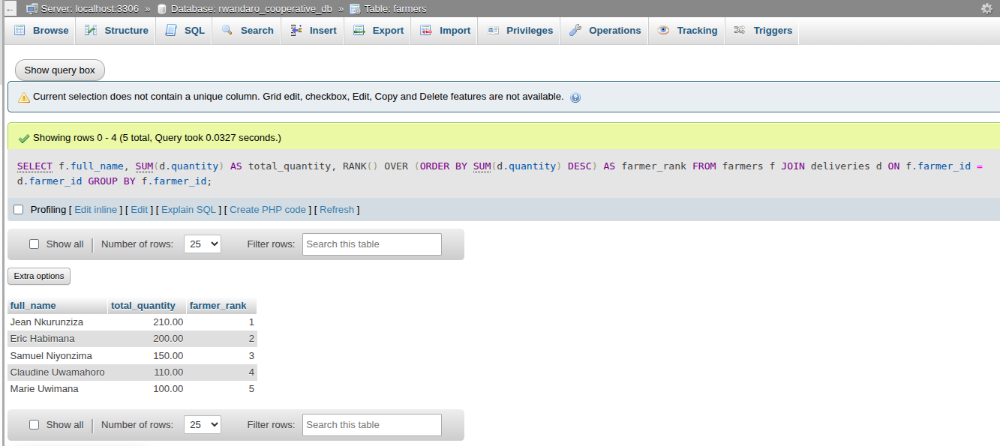
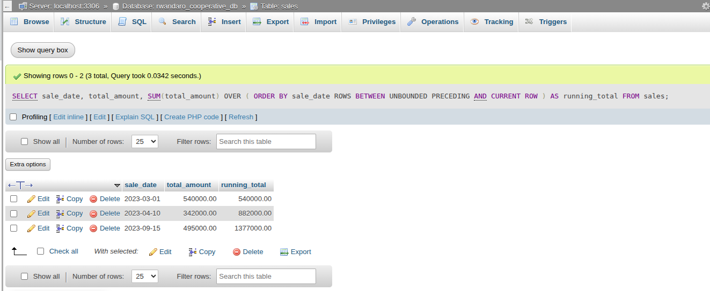
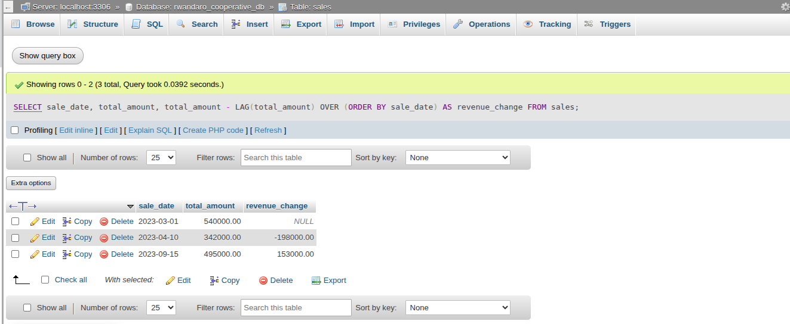
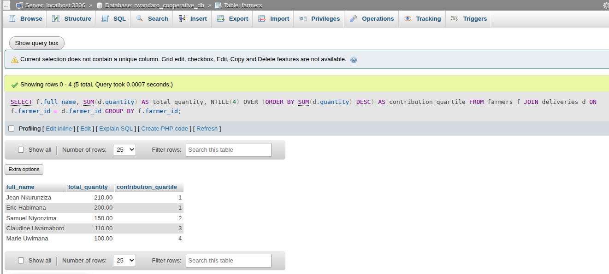
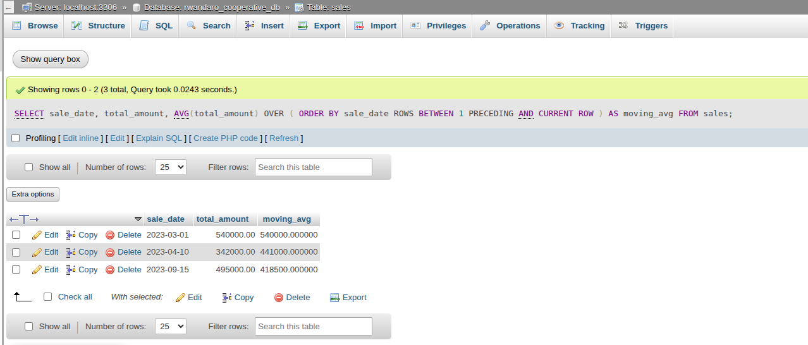

# WINDOW FUNCTIONS

## 1. Ranking farmers by total deliveries
Ranking functions such as ROW_NUMBER(), RANK(), DENSE_RANK(), and PERCENT_RANK() are used to rank farmers based on their total sales contribution. This helps identify top performers and supports incentive allocation.
```sql
SELECT
    f.full_name,
    SUM(d.quantity) AS total_quantity,
    RANK() OVER (ORDER BY SUM(d.quantity) DESC) AS farmer_rank
FROM farmers f
JOIN deliveries d ON f.farmer_id = d.farmer_id
GROUP BY f.farmer_id;
```


## 2. Running total of sales revenue
Aggregate window functions including SUM() OVER() and AVG() OVER() are used to compute running totals and moving averages of sales revenue. These metrics help track cooperative growth trends over time.
```sql
SELECT
    sale_date,
    total_amount,
    SUM(total_amount) OVER (
        ORDER BY sale_date
        ROWS BETWEEN UNBOUNDED PRECEDING AND CURRENT ROW
    ) AS running_total
FROM sales;
```


## 3. Month-over-month sales comparison
Navigation functions such as LAG() and LEAD() are used to compare current sales values with previous periods. This analysis reveals month-to-month growth or decline patterns.
```sql
SELECT
    sale_date,
    total_amount,
    total_amount -
    LAG(total_amount) OVER (ORDER BY sale_date) AS revenue_change
FROM sales;
```


## 4. Farmer segmentation using NTILE
Distribution functions such as NTILE(4) and CUME_DIST() are used to segment farmers into contribution groups. This segmentation supports targeted training and performance-based incentives.
```sql
SELECT
    f.full_name,
    SUM(d.quantity) AS total_quantity,
    NTILE(4) OVER (ORDER BY SUM(d.quantity) DESC) AS contribution_quartile
FROM farmers f
JOIN deliveries d ON f.farmer_id = d.farmer_id
GROUP BY f.farmer_id;
```


## 5. Moving average of sales revenue
```sql
SELECT
    sale_date,
    total_amount,
    AVG(total_amount) OVER (
        ORDER BY sale_date
        ROWS BETWEEN 1 PRECEDING AND CURRENT ROW
    ) AS moving_avg
FROM sales;
```


